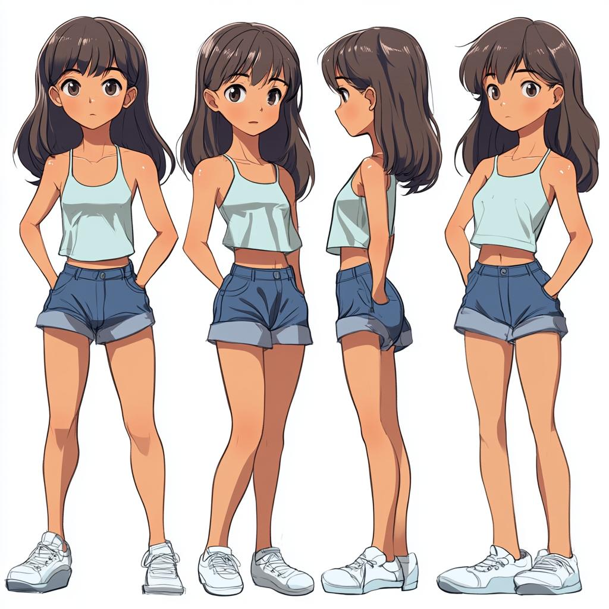
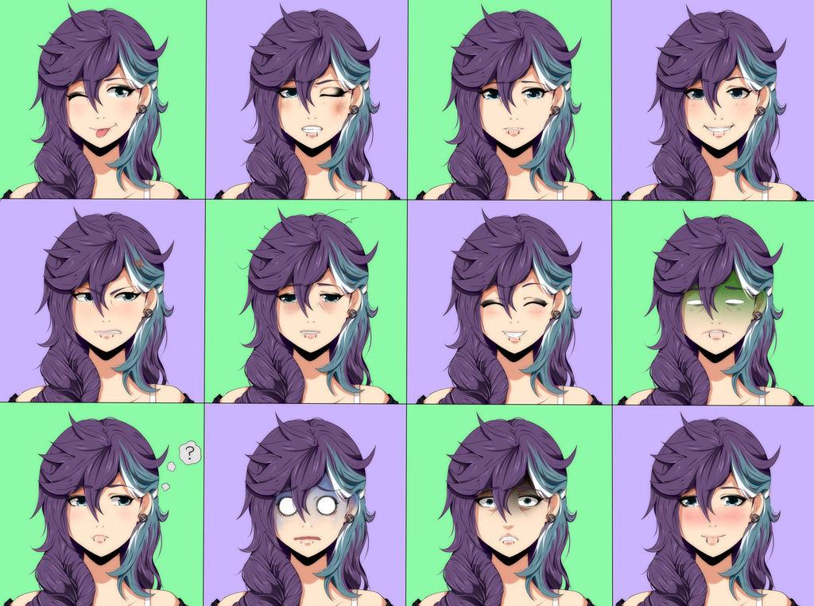
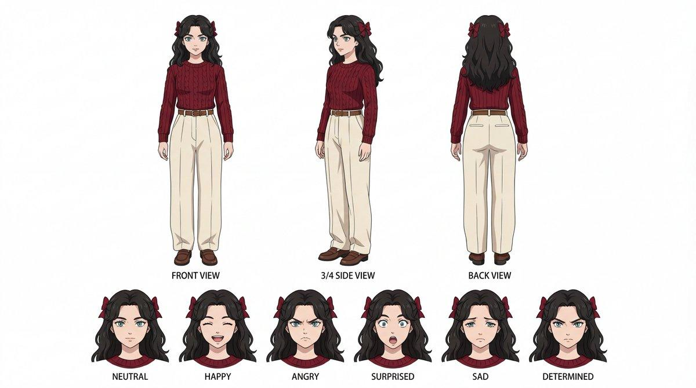
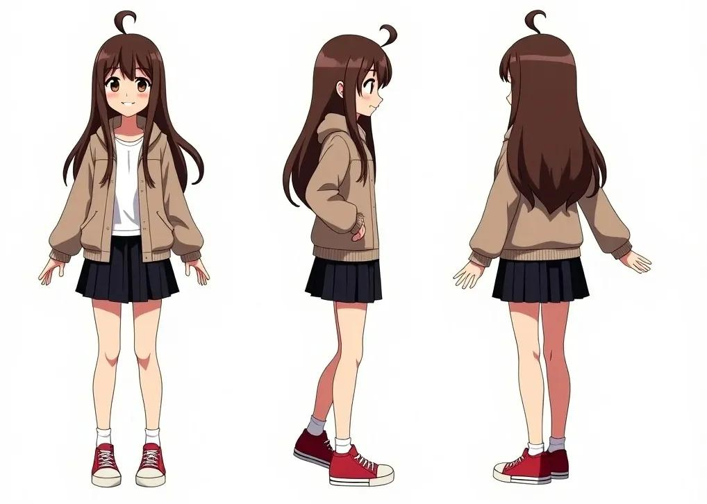
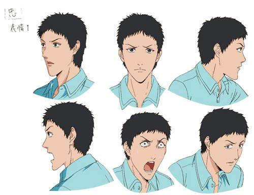
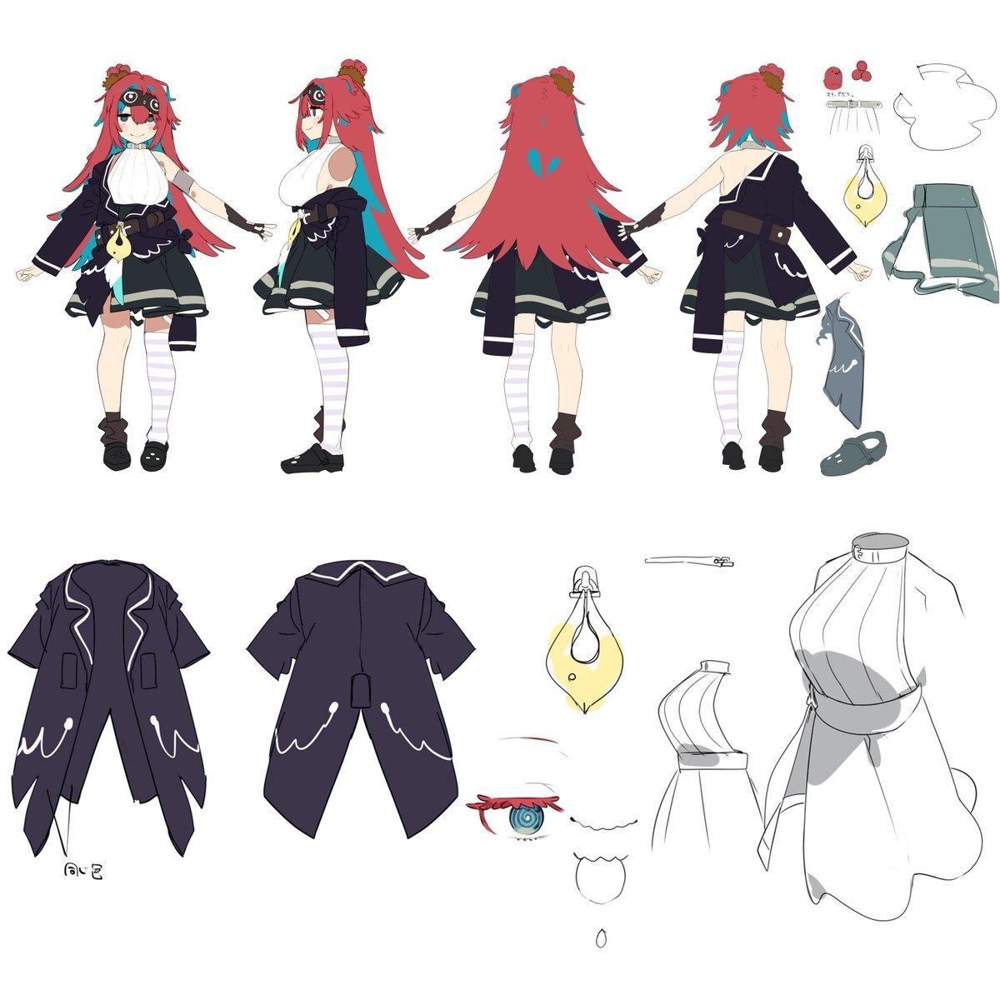

# Codex Images：維持角色一致性的方法

在 Codex 的 Images 功能裡產圖時，要讓同一個角色在多張圖中保持一致，通常有以下幾種做法。由易到難、由弱到強排列。

---

## 方法 1：使用同一張角色圖作為後續編輯（效果最好）

先產生角色 A：

> 25 歲亞洲女性，短黑髮，琥珀色眼睛，左眼下有淚痣，穿深藍色風衣

然後每次變化時，**上傳這張圖**並要求：

> 保持人物臉部、髮型、五官比例、服裝設計完全一致，只改變姿勢與背景。

例如：

- 改成海邊場景
- 改成坐在咖啡廳
- 改成賽博龐克風格
- 改成全身照

因為模型有實際參考圖，所以一致性最高。

---

## 方法 2：建立「角色聖經」（Character Sheet）

每次提示詞都固定描述角色：

```text
Character:
- Female
- 25 years old
- Short black bob haircut
- Amber eyes
- Beauty mark under left eye
- Navy trench coat
- Slim build
- East Asian appearance

Keep this character identical in every image.
```

然後在**同一個 session** 再加入變化：

```text
Same character, standing in Tokyo at night.
```

下一張：

```text
Same character, riding a bicycle.
```

下一張：

```text
Same character, fantasy knight version.
```

這樣比每次重新描述好很多。

---

## 方法 3：先做角色設定圖（Turnaround Sheet）

先要求生成：

> Character design sheet, front view, side view, back view, expression sheet

類似以下範例：

### 全身多視角 turnaround



### 表情表（expression sheet）



### 正面 / 側面 / 背面 + 表情表



### 三視角全身 turnaround



### 男性角色表情表



### 完整角色設定圖（含服裝細節）



之後所有圖片都引用這張設定圖。

這是專業遊戲、美術、漫畫工作室最常用的方法。

---

## 方法 4：要求模型建立唯一識別特徵

如果角色長得太普通：

> 黑長髮女生

模型很容易漂移（drift）。

如果改成：

> 左眼下有淚痣、異色瞳（左藍右金）、銀色耳骨耳環、深藍風衣

一致性會大幅提高。

---

## Codex / ChatGPT Images 的限制

即使如此，仍然可能發生：

- 臉型微變
- 髮長改變
- 衣服細節跑掉
- 年齡感不同
- 畫風略有變化

尤其當你要求以下變化時，一致性會明顯下降：

- 換畫風（動漫 → 寫實）
- 換年齡
- 換性別
- 換種族
- 大幅改變服裝

---

## 最穩定的工作流程

如果你想做：

- 漫畫角色
- VTuber
- 遊戲角色
- 小說主角
- 長期連載角色

建議：

1. 先產生角色設定圖
2. 挑選最滿意的一張
3. 後續每次都把該圖當參考圖上傳
4. 明確要求「保持角色完全一致」

這樣通常能達到 **80%～95% 的角色一致性**，遠高於只靠文字提示。

如果要做的是「同一個角色連續幾十張甚至上百張圖片」，還可以再搭配下面這套專門給 Codex Images 使用的「角色鎖定 Prompt 模板」，讓角色穩定度進一步提高。

---

## 角色鎖定 Prompt 模板

整套流程分三段：先用 **A. 主檔模板** 建立並凍結角色，每次出圖用 **B. 變化模板** 只改該改的，發現漂移時用 **C. 修正模板** 拉回來。把方括號 `[ ]` 內的內容替換成自己的設定即可。

### A. 主檔模板（建立角色聖經，只做一次）

第一張圖用這份模板生成「角色設定圖」，挑出最滿意的一張當作之後所有圖的參考圖。

```text
[CHARACTER BIBLE — LOCK THIS]
Name: [角色名]
Sex / Age: [女性 / 25 歲]
Face: [瓜子臉、琥珀色眼睛、左眼下淚痣、鼻樑挺]
Hair: [黑色、短鮑伯頭、瀏海齊眉]
Body: [纖細、身高約 165cm]
Signature features (must always appear): [異色瞳 左藍右金、銀色耳骨環、左頸一顆小痣]
Outfit (default): [深藍色長風衣、白襯衫、黑窄褲、馬丁靴]
Art style: [日系動漫賽璐珞上色、線稿乾淨、柔和打光]

[TASK]
Character design sheet on plain white background:
front view, 3/4 side view, side view, back view,
plus an expression sheet (neutral, happy, angry, surprised, sad, determined).
Keep proportions and all signature features identical across every view.
```

### B. 變化模板（每次出圖，固定貼這段）

**重點：上傳步驟 A 選定的參考圖**，再貼下面這段。每次只改「VARIATION（本次變化）」一行，其餘保持不動。

```text
[REFERENCE] 使用我上傳的角色圖。

[LOCK — 不可改動]
臉部、五官比例、髮型髮色、體型、年齡感、畫風，
以及所有 signature features（[異色瞳、耳骨環、頸部痣]）必須與參考圖完全一致。

[VARIATION — 本次只改這裡]
場景 / 姿勢 / 鏡頭：[坐在雨夜的咖啡廳窗邊，半身，從側面拍]
服裝：[維持預設 / 改為：______]

[NEGATIVE — 避免]
不要改變臉型、不要改髮長、不要換年齡、不要漂移畫風、不要新增或刪除 signature features。
```

> 小技巧：把 `[LOCK]` 與 `[NEGATIVE]` 兩段存成固定片語，每次只動 `[VARIATION]`，能大幅降低手動描述造成的漂移。

### C. 修正模板（角色跑掉時拉回來）

當某張圖臉型 / 髮長 / 配件跑掉，用這段點名修正：

```text
[REFERENCE] 以我上傳的角色圖為唯一基準。

上一張圖出現偏差，請修正以下幾點，使其回到參考圖：
- [臉變圓了 → 回到瓜子臉]
- [瀏海變長 → 回到齊眉]
- [漏掉耳骨環 → 補回銀色耳骨環]
其餘構圖、姿勢、背景維持上一張不變。
```

### 連載 / 大量產圖的補充原則

- **一個 session 一個角色**：同一對話中只處理同一角色，模型的上下文記憶會幫你穩定。
- **鎖定 seed 風格**：若平台支援固定 seed，主檔與變化盡量沿用同一 seed。
- **signature features 寧多勿少**：愈獨特、愈難「猜錯」的特徵（淚痣、異色瞳、特定配件）愈能抵抗漂移。
- **定期回錨**：每出 8～10 張，就拿最初的主檔參考圖重新比對一次，避免一路「漂移累積」。
- **換大方向另開主檔**：要換畫風 / 年齡 / 性別這種大改時，不要硬凹同一檔，先用模板 A 重做一張新的主檔再分支。
