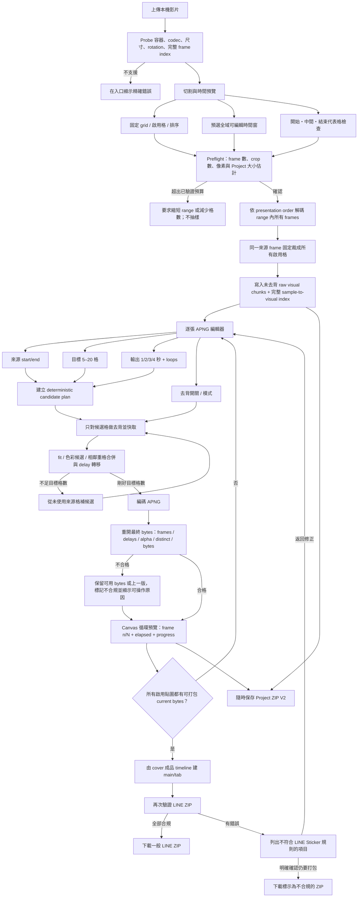

# Video to APNG 操作流程 V2 計畫

- 狀態：V2 beta 已實作並完成自動驗收；仍需以真實素材與 LINE 上傳結果持續校正
- 日期：2026-07-31
- 產品確認日期：2026-08-01
- 範圍：Web `影片 → APNG` 工作流
- 與既有文件的關係：本文件重新設計 `plan/video-to-apng-plan.md` 已完成 MVP 的操作流程；既有文件仍保留作為目前實作與 Project ZIP V1 的歷史基線
- 實作完成日期：2026-08-01
- 交付證據：shared-core tests、Project V2/V1 contract、all-frame dependency/resource spike、browser E2E

> 本文件保留動工前的 source 證據與決策脈絡；其中「現況」段落描述的是 V2 實作前基線，
> 不應當作目前 application behavior。現況請以 `README.md`、`ARCHITECTURE.md` 與 source 為準。

## 1. 結論先行

V2 應把目前的「先指定 10/20/30/40/60 個 master 取樣點」改為兩層時間軸：

1. **來源層**：保存使用者預選時間窗內的所有 decoded presentation samples，以及每格真實 timestamp/duration；像素完全相同的 sample 可共用 visual payload，但時間紀錄不可消失。
2. **LINE 成品層**：每張貼圖可獨立選來源秒數區間、目標 5–20 格、單輪 1–4 秒、loops 與是否去背；工具再從該張的完整來源時間軸自動選出確切目標格數。

主要操作順序：

```text
上傳影片
  → 顯示裁切示意與來源時間範圍
  → 確認後擷取範圍內所有 presentation frames
  → 建立每張貼圖的未去背 raw master
  → 逐張調整時間、格數、播放與去背
  → 自動選格、產生可控制循環與進度的預覽
  → 全張完成成品驗證
  → 合規時建立一般 LINE ZIP；不合規時明確提示，確認後仍可建立標示為不合規的 ZIP
  → 隨時可建立 Project ZIP
```

「所有 frame」在本計畫中有精確定義：**所選全域可編輯時間窗內，影片軌實際包含的所有 presentation samples**。不是每個壓縮 packet、不是依平均 FPS 猜出的格子，也不是把整支影片每毫秒擷取一次。若兩個 sample 像素相同，manifest 仍保存兩筆 timestamp/duration，只允許它們指向同一份去重後像素資料。

## 2. 現況證據與需要改變之處

| 現況 | Source 證據 | V2 缺口 |
|---|---|---|
| 上傳後只擷取第 0 秒做固定等分 grid 示意 | `web/src/ui/VideoTab.tsx:373-397`、`:115-134` | 應能 scrub，至少同時檢查開始／中間／結束代表格 |
| master 格數是 10/20/30/40/60 下拉選單 | `web/src/ui/VideoTab.tsx:307`、`:761-764` | 刪除取樣格數；改顯示所選區間的實際來源格數 |
| 來源 adapter 以 `<video>.currentTime` seek 指定時間 | `web/src/webpipe/videoSource.ts:54-115` | 無法列舉所有 frame，也沒有可靠的 VFR timestamp、duration、rotation 或 codec probe |
| `planSampleTimestamps` 只產生均勻時間點 | `src/core/videoCrop.ts:78-99` | 不再用於 V2 ingest；只能保留給 V1 legacy project 或其他明確的取樣用途 |
| 去背在 master 建立時全域決定並烙入 | `web/src/ui/VideoTab.tsx:442-477`、`web/src/webpipe/masterApng.ts:110-135` | master 失去原 RGB，之後無法逐張切換去背；語意去背次數又等於來源格數 × 貼圖數 |
| 每張已可設定 range、5–20 格、播放秒數與 loops | `web/src/ui/VideoTab.tsx:137-249` | 保留此能力，但應改成 timeline/editor，而不是密集表單清單 |
| 成品可能因 byte auto-fit 偷偷少於使用者設定格數 | `web/src/webpipe/processMasterApngSticker.ts:126-160`、`web/src/webpipe/apng.ts:216-246` | 目標格數要成為 hard target；不能以一般成功狀態靜默減格 |
| APNG 預覽只是 `` | `web/src/ui/common.tsx:154-165` | 無法控制 loop、pause、restart、current frame 或播放進度 |
| 只驗所有畫格是否完全相同 | `src/core/validate.ts:102-145`、`web/src/webpipe/processMasterApngSticker.ts:64-89` | 要在最終量化後處理相鄰相同格、合併 delay，再重開成品驗證 |
| Project ZIP V1 保存已取樣且可能已去背的 master | `web/src/webpipe/videoProjectZip.ts:38-173` | V2 需標示 frame coverage 與背景是否已烙入，不能假裝 V1 擁有缺失的 frame/RGB |
| 目前 `VideoTab.tsx` 已有 1,102 行 | `web/src/ui/VideoTab.tsx` | V2 必須拆出 step、editor、preview 與 domain state，不能繼續堆在單檔 |

另有一個既有時間缺口要一起處理：`web/src/webpipe/masterApng.ts:46-52` 會把上一個 interval 複製給最後一格，master APNG 的總 delay 可能超出 editable range；V2 應直接保存每個來源 sample 的真實 duration，並在 range 邊界裁切有效 duration。

## 3. 動工前需求審視（質疑 → 刪除 → 優化）

### Step 1 — 需求審視

| 需求 | 判定 | 具體理由 |
|---|---|---|
| 上傳後立即顯示裁切示意與預選時間範圍 | 成立 | 目前只有第 0 秒 preview；若角色在第 3 秒跨格，使用者要等完整 master 完成後才發現 |
| 所選時間範圍取出所有 frame | 成立但需精確定義 | V2 保存 range 內所有 presentation frames；不能用 30 FPS 乘秒數推算 VFR，也不能再顯示 10/20/30/40 的取樣選項 |
| 每張 APNG 有自己的 frame 數 | 成立 | LINE 允許每張 5–20 格，8 張貼圖不需要被迫共用同一格數 |
| 每張 APNG 可調自己的秒數區間 | 成立 | raw master 有完整時間軸後，逐張 range 不必重新解碼來源影片 |
| 每張 APNG 可選擇是否去背 | 成立但條件性 | 必須把 master 改成未去背；V1 已烙入去背的 Project 無法恢復 RGB，需明示 legacy 限制 |
| 調整後自動挑到設定格數 | 成立 | `targetFrames=12` 的合規結果就必須是 12 格；若動作不足或 1 MB 無法容納，回可操作錯誤，不可悄悄輸出 8 格；錯誤不終止其他貼圖的編輯、預覽或 Project 保存 |
| 驗證錯誤後仍可繼續與打包 | 成立但需區分狀態 | 只要每個必要 ZIP entry 都有可打包 bytes，使用者可明確確認後輸出不合規 ZIP；UI、檔名與報告不得把它宣稱為符合 LINE 規格或可上架成品 |
| 預覽循環播放並顯示進度 | 成立 | `` 沒有可靠 timing callback；需用 decoded frames + delays 建 controlled canvas player |
| LINE 不允許連續相同 frame | 需要語意修正 | LINE 官方寫的是連續重複圖可能被 APNG 工具合成一格，全部相同會上傳失敗；因此要 canonicalize 序列內相鄰格並驗最終格數，但不能把首尾相同視為錯誤，官方甚至建議某些動畫首格可與末格相同 |
| 對所有來源 frame 預先跑語意去背 | 刪除 | 4 秒 60fps × 24 格等於 5,760 次推論，使用者最後每張最多只輸出 20 格；這不是必要工作 |
| 同時讓 24 張 APNG 永久 autoplay | 刪除 | 24 個計時器與 canvas decode 會浪費 CPU；列表顯示 poster，只有目前編輯張與使用者明確展開的比較張播放 |

### Step 2 — 刪除建議

- 刪除 `master 取樣格數` 欄位；超出資源預算時要求縮短全域時間窗或減少啟用格，不能用抽樣偽裝成「所有 frame」。
- 刪除 ingest 階段的單一全域去背決定；改成「專案預設 + 每張 override」，在成品候選 frame 上延遲執行。
- 刪除預設同時產生所有 baseline/current 雙份 APNG。完成 raw master 後先顯示 poster 與預設設定，使用者產生預覽時才編碼。
- 刪除一般模式中的 `maxColors` 主控制；移到進階設定與診斷報告。一般使用者只需要知道「保留設定格數是否可在 1 MB 內完成」。
- 刪除 silent frame auto-fit。V2 可自動降色，但不得未經同意降低 `targetFrames`。
- 刪除「任一 LINE validation error 就完全禁止輸出 ZIP」的絕對阻擋；改成合規狀態 gate。全部通過才提供一般 LINE ZIP，有錯誤時列出貼圖與原因，使用者明確確認後才可輸出標示為不合規的 ZIP。
- 不在本版加入逐 frame offset、物件追蹤、任意 crop rect 或 motion-aware AI 選格；這些都不是本次流程成立的必要條件。

### Step 3 — 優化建議

- 解碼一次來源 frame，同一 frame 服務所有 crop，之後立即釋放大 frame；raw crop 以小 chunk 寫入 master。
- 語意去背只處理實際候選格，並以 frame hash + remover/version/settings 做 session cache；候選不足時才逐步擴張。
- APNG preview 與 processing progress 使用兩個不同元件與文字，避免「播放 60%」被誤認成「打包 60%」。

## 4. 建議的完整流程



## 5. 各畫面的操作設計

### Step 1 — 上傳與 probe

上傳後先做 metadata/frame-index probe，不立即建立 APNG：

- 顯示檔名、容器、codec、duration、display size、rotation、平均 FPS 與**實際總 frame 數**。
- 預設全域可編輯時間窗：`0 → min(影片長度, 4 秒)`；使用者可拉長到影片內任意範圍。
- 若無可解碼 video track、codec 不支援、rotation/display geometry 無法解析，在此停止。
- 保留「上傳 Project ZIP」入口；Project import 不初始化影片 decoder。

來源 timing 以整數 microseconds 保存。UI 可顯示秒或毫秒，但不可把浮點秒當 manifest 真相。

### Step 2 — 切割示意與全域可編輯範圍

- 維持 V2 第一版的固定等分 grid：count、cols、rows、row-major 排序。
- 主 preview 可 scrub；grid overlay 永遠以 display-pixel coordinates 畫出。
- 顯示 start / middle / end 三個小預覽，讓使用者在建立 master 前看到跨格、空格或鏡頭移動。
- range handles snap 到實際 frame boundary；同時顯示「輸入時間」與「採用時間」。
- 顯示精確或可解釋的 preflight：
  - 所選來源 frames 數。
  - 啟用 crop 數。
  - 會產生的 crop-frame 數。
  - 估計 raw master bytes、暫存峰值與預估時間級別。
- 超過經 benchmark 確認的資源預算時，入口阻止開始並建議縮短 range；不出現「改成 20 格取樣」退路。

完成 ingest 後，grid 與全域 range 成為 raw master 邊界。若要移動 grid 或取回 range 外畫格，需重新指定來源影片；Project ZIP 不嵌入原影片。

### Step 3 — 全格 raw master 建立

- 依 presentation order 串流解碼全域 range 內所有 sample。
- range 邊界使用 interval intersection：第一與最後 sample 的有效 duration 要裁到 `[rangeStart, rangeEnd)`；若 decoder 沒給 duration，使用下一個 timestamp，最後一格使用 range end 推導，不能複製上一格 delay。
- 每次只保留一個大 source frame；在釋放前裁出所有啟用格。
- crop 立即 resize 到該張的 source-master canvas，計算 lossless RGBA hash，再寫入 raw visual chunk；hash 只作索引，判定共用 payload 前仍要比較完整 dimensions + RGBA bytes，不能把 hash collision 當相同畫面。
- 每個來源 sample 都保存一筆 `sampleRef`；相鄰像素完全相同時可共用 `visualFrameId`，但不能合併或丟失兩筆來源 timestamp/duration。這避免 APNG encoder 自行合併時讓 all-frame timeline 失真。
- raw visual APNG chunk 只是 lossless bitmap container；它的 delay 不是來源時間軸真相。V2 以 `sampleRef.timestampUs/durationUs` 還原播放，import 時比較的是 decoded visual count 與 visual index，不再要求 APNG frame count 等於 source sample count。
- raw master 不去背、不描邊、不疊字、不做 character stabilization。
- chunk manifest 保存每格 `sourceIndex/timestampUs/durationUs/visualFrameId`，並驗證無缺口、重複或逆序。
- raw chunk bytes 不長期放在 React state。新增 async `VideoMasterStore`，state 只保存索引；小檔可用 memory backend，超過門檻後使用經 quota probe 的 browser storage backend。UI 必須說明暫存位置並提供「清除暫存」。
- 取消時丟棄本次不完整 ingest；不可覆蓋上一個完整 Project。

### Step 4 — 每張 APNG 編輯器

列表只顯示 poster、狀態與摘要；點一張後開啟單張 editor：

- 來源 timeline：顯示 raw master frames，長序列使用 virtualization，不把所有 thumbnail 同時解碼。
- Start/end：限制在全域 editable range，snap 到 frame interval。
- 目標格數：5–20，逐張保存；預設 `min(20, range 內可用 distinct source frames)`。
- 單輪時間：1/2/3/4 秒；預設取最接近來源 span 的合法整數秒，clamp 到 1–4。
- Loops：只顯示 `perLoopSec × loops <= 4` 的合法選項。
- 顯示 `來源 2.8 秒 → 成品 2 秒（1.40× 加速）`；這是結果說明，不改合法 duration 限制。
- 去背：`關閉` / `沿用專案預設` / `本張啟用指定模式`。模式沿用現有 color-key、IMG.LY、local BiRefNet、Colab BiRefNet。
- 顯示第一個實際成品 frame，要求使用者能確認它作為靜態貼圖仍能表達意涵。
- 設定變更先標記 draft；按「產生這張預覽」才執行可能昂貴的去背與 encode。失敗保留上一個 current。
- 單張失敗不停止其他貼圖的編輯或批次處理；失敗狀態與 validation evidence 保留到打包提示和 Project report。

全包操作只提供：

- 套用共同的 duration/loops/去背預設。
- 逐張維持自己的 range 與 targetFrames。
- 依序產生所有 dirty previews，顯示 `貼圖 i/N` 與該張內部階段。

### Step 5 — 可控制的循環預覽

不要再用 `` 當唯一動畫 player。新增 Video 專用 `ApngTimelinePlayer`：

- 先 decode current APNG 成 composited frames + delays。
- 用同一個 scheduler 支援播放、暫停、重新開始與無限 preview loop；preview loop 不改成品的 finite `num_plays`。
- 顯示：`第 n/N 格`、`elapsed / per-loop duration`、百分比 progress bar。
- tab 背景化或 component hidden 時暫停 scheduler；回來後由目前 loop 重新開始，避免大幅跳格。
- 一次只 autoplay active editor；列表與 compare grid 使用 poster 或點擊才播放。
- 驗證 preview 使用的 frames/delays 與 final APNG bytes 解碼結果相同，不能用 draft timing 模擬。

另保留獨立的工作進度：

- `解碼來源 frame 83/240`
- `裁切 8 張中的 5 張`
- `第 03 張去背候選 7/14`
- `第 03 張 encode / final verify`
- `打包貼圖 6/8`

## 6. 自動選格與相鄰重格處理

### 6.1 選格目標

一般成功條件是：

```text
finalDecodedFrameCount === requestedTargetFrames
```

若使用者選 12 格，工具不可只因 1 MB auto-fit 而靜默輸出 9 格。品質階梯順序改成：

1. 固定 12 格，從 lossless 到逐步減色尋找可行候選。
2. 每個候選 encode 後重開驗證實際 frame 數與相鄰畫格。
3. 所有色彩候選仍超過 1 MB 時，以錯誤回報，建議縮小 source range、改 5–11 格或簡化背景；保留最佳的 exact-target 候選供預覽，並允許繼續處理其他貼圖與保存 Project。
4. 未來若要加入「允許自動減格」，必須是獨立 opt-in，不是預設。

若使用者最後仍要打包含有超過 1 MB 或其他 LINE validation error 的成品，打包 dialog 必須逐項顯示不合規原因並要求明確確認；輸出不得使用一般成功或可上架語意。

### 6.2 Deterministic selection V1

第一版採可解釋的 time-uniform distinct selection，不先加入 motion/AI heuristic：

1. 取得 sticker range 內所有 source frame refs。
2. 先選一組均勻分布的候選，保留 range 起點與尾端附近 frame。
3. 只對候選做背景處理與 final transform。
4. 對 transform 後像素建立相鄰 run；相同 run 的 duration 合併到前一個保留格。
5. run 不足 target 時，從尚未處理、且距目前選取 timestamps 最遠的 source frame 補候選。
6. run 足夠後，再 time-uniform 選出確切 target 個 run。
7. 把來源 run duration 按比例映射到合法的 1000/2000/3000/4000ms，使用 largest-remainder 分配，總和必須精確。

每次 selection report 保存：candidate indices、selected indices、removed-adjacent indices、補選 indices、source timestamps、source durations 與 final delays。

### 6.3 打包前 canonicalization

`coalesceAdjacentFrames(frames, delays)` 必須是 shared-core 可測純函式，規則如下：

- 比較的是 final render/quantization 後 decode 得到的完整 RGBA composited pixels。
- 若 frame `i` 與前一個已保留 frame 完全相同，刪除 `i`，把 `delay[i]` 加到前一格。
- 不把最後一格與第一格當相鄰重格；LINE 官方允許首格與末格相同。
- canonicalize 後若少於 target，回到候選補選；若所有 source frames 都試過仍不足，顯示「此範圍最多只有 X 個可區分畫格」。
- canonicalize 後若少於 5 格，標記為不符合 LINE 規格；不可當成合規成品，但不阻止繼續編輯、保存 Project，或在明確確認後輸出不合規 ZIP。
- 最終解碼若仍有相鄰重格、總 delay 改變、或 frame count 不等於 target，視為 encoder contract failure。不得提供一般 LINE ZIP 成功狀態；若仍有可打包 bytes，只能走明確確認的不合規 ZIP 路徑。

這項處理比「只驗 `distinctFrames >= 2`」更嚴格，但不錯誤禁止合法的非相鄰重用或首尾相同。

## 7. 去背策略

### 7.1 資料分層

```text
raw master frame（未去背、完整 RGB/RGBA）
  → selected candidate
  → optional background removal
  → fit / color / APNG
```

- `none`：保留來源 alpha/RGB；若最終背景沒有透明像素或 opaque edge 過高，成品驗證失敗並提示開啟去背。
- `color-key`：可在候選 crop 上執行；背景色與 tolerance 寫入 sticker settings。
- `IMG.LY/local/Colab BiRefNet`：只處理候選 frames，序列化執行，無 silent fallback。
- Colab endpoint/session key 仍只存在目前 page memory，不寫入 Project ZIP、URL、storage 或 report。

### 7.2 Cache

bounded session LRU cache key 至少包含：

```text
stickerId + rawFrameHash + removerMode + removerVersion + removerSettings
```

- 改 duration/loops 不應重跑去背。
- 改 target/range 時只對新加入候選跑去背。
- 關閉去背直接使用 raw master。
- cache 超過 Task 0 定出的 byte budget 時可淘汰舊結果；淘汰只影響下次耗時，不得改變 selection 或成品 correctness。
- V2 Project ZIP 保存 raw master 與 current renders，不強制保存大量 model cache；重開後若要換 range/去背模式，可能需要重新載入模型或重連 Colab。

## 8. Domain contracts 與 Project ZIP V2

`src/core/` 保持 platform-neutral；不放 `VideoFrame`、Canvas、Blob 或 DOM。

建議新增／取代的核心契約：

```ts
interface SourceFrameRef {
  sourceIndex: number;
  timestampUs: number;
  durationUs: number;
  chunkId: string;
  visualFrameId: string;
}

interface RawVisualFrameRef {
  visualFrameId: string;
  rgbaHash: string;
  chunkId: string;
  frameInChunk: number;
}

interface VideoStickerDraftV2 {
  stickerId: string;
  rangeStartUs: number;
  rangeEndUs: number;
  targetFrames: number; // 5..20, hard target
  perLoopDurationMs: 1000 | 2000 | 3000 | 4000;
  loops: 1 | 2 | 3 | 4;
  background: VideoBackgroundSettings;
}

interface VideoSelectionPlanV2 {
  candidateSourceIndices: number[];
  selectedSourceIndices: number[];
  removedAdjacentSourceIndices: number[];
  replacementSourceIndices: number[];
  sourceTimestampsUs: number[];
  finalDelaysMs: number[];
}
```

Project manifest 升到 V2，新增：

- `sourceTimingUnit: 'microseconds'`
- `frameCoverage: 'all-presentation-frames' | 'sampled-legacy'`
- `backgroundStage: 'raw' | 'baked-legacy'`
- 每張 raw master 的完整 sample index、visual chunk checksum、range 與 canvas。
- 每張 raw master 的 `sampleRef -> visualFrameId` 對應；Project 可以像素去重，但不能時間軸去重。
- 每張 draft/current 的 background settings、selection report、final decoded evidence。
- decoder/demuxer/app/remover version。

### V1 相容政策

- V1 Project 可匯入，但標示「舊版取樣專案」。
- 映射成 `frameCoverage='sampled-legacy'`；range editor 只能使用 V1 已保存 timestamps。
- 若 V1 master 已去背，映射成 `backgroundStage='baked-legacy'`，停用「恢復未去背」與更換背景模式。
- 不從平均 FPS 補造缺失 frames，也不宣稱已升級成 all-frame master。
- 使用者重新指定原影片並完成 V2 ingest 後，才轉成完整 V2 project。

## 9. 解碼架構決策

目前 `<video>` seek adapter 必須更換，因為它只接受「給我某個時間附近的畫面」，無法證明列舉了所有 presentation frames。

建議先做一個有停止條件的 dependency spike：

- 候選：以容器 demux + WebCodecs 為基礎的 browser adapter；優先評估 Mediabunny 的 `VideoSampleSink.samples()` presentation-order iterator。
- adapter 介面至少提供：
  - `probe(file)`：track、codec、display geometry、rotation、duration、first timestamp、frame count。
  - `frameIndex(range)`：不解碼像素或最低成本取得 frame timestamps/durations。
  - `frames(range, signal)`：presentation order async iterator。
  - `sampleAt(timestamp)`：切割示意用代表格。
  - `dispose()`。
- 每個 decoded sample 使用後立即 release；WebCodecs 規格明確要求及早關閉 `VideoFrame`，避免 decoder stall/資源耗盡。
- Vite/TypeScript 相容性要在採用前驗證；目前 Web devDependency 是 TypeScript `^5.6.2`，若最新候選要求 5.7+，需把升級列為明確 dependency change。
- spike 必須用 CFR、VFR、rotation、非零首 timestamp 與 unsupported codec fixture。
- 若候選不能穩定列舉 presentation frames、取消、或在目標瀏覽器釋放資源，停止實作；不得退回 `<video>` seek 後仍稱為「所有 frame」。

參考：

- [LINE Animated Sticker Requirements](https://creator.line.me/en/guideline/animationsticker/)
- [LINE Frame and Loop Details](https://creator.line.me/en/guideline/animationsticker/detail/)
- [W3C WebCodecs](https://w3c.github.io/webcodecs/)
- [Mediabunny media sinks](https://mediabunny.dev/guide/media-sinks)

## 10. 打包與最終驗證

要以「符合 LINE 規格」的成功狀態建立一般 LINE ZIP，必須符合：

- 所有啟用 sticker 都沒有 dirty draft，且 current render 通過 final-byte validation。
- 每張 final decoded frames 精確等於自己的 targetFrames，介於 5–20。
- 單輪 delays 精確加總 1000/2000/3000/4000ms；乘 loops 不超過 4 秒。
- 序列內沒有相鄰相同 decoded RGBA frames；至少有兩個 distinct visual states。
- 背景透明、前景非空、尺寸／偶數／1 MB 限制通過。
- 第一格有獨立 poster preview；若無法做語意自動判定，至少要求使用者可見確認。
- `main.png` 直接沿用 cover sticker 的 final frames、delays、loops；main 自己只可調尺寸／色彩，不可另選 frames 或重算 timing。
- `tab.png` 使用 cover 的 final 第一格。
- main/tab 同樣從 final bytes 驗格式、alpha、content、bytes、frames、delays 與 loops。
- validation 失敗不阻止使用者繼續編輯、預覽其他貼圖或保存 Project ZIP。
- 打包時若有 validation error，dialog 必須列出 sticker、entry 與原因，預設動作是返回修正；使用者明確確認後可下載檔名、UI 與 report 都標示為不合規的 ZIP。
- 缺少必要 entry bytes、ZIP 本身無法建立或內容無法重開時屬於結構性失敗，不能用確認略過。

Project ZIP V2 與 LINE ZIP 仍完全分離：LINE ZIP 不包含 raw master、manifest、來源影片、模型 cache 或 report。

## 11. 實作任務

### Task 0 — All-frame decoder 與資源預算 spike

**檔案**

- 新增 `web/scripts/video-all-frames-spike.mts`
- 視結果更新 `web/package.json`、`web/package-lock.json`、`web/vite.config.ts`

**工作與驗收**

- 對 CFR/VFR/rotation fixtures 列出所有 `timestampUs/durationUs`，與 fixture ground truth 一致。
- 取消後 iterator/decoder 停止，所有 frame resources 關閉。
- 量測 4 秒 30/60fps × 8/24 crops 的 peak memory、master bytes、解碼時間，據此定 preflight hard budget；不能先拍腦袋寫常數。

### Task 1 — Shared timeline、selection 與 duplicate canonicalization

**檔案**

- refactor `src/core/videoCrop.ts`
- 新增 `src/core/videoTimeline.ts`
- 新增 `src/core/frameSequence.ts`
- 更新 `test/videoCrop.test.ts`
- 新增 `test/videoTimeline.test.ts`、`test/frameSequence.test.ts`

**工作與驗收**

- source truth 改用 integer microseconds，輸出 APNG delay 才轉 integer milliseconds。
- 實作 range interval clipping、time-uniform candidate expansion、exact duration allocation。
- 實作 adjacent-only coalesce + previous-delay merge；測 first=last 不被合併。
- 5/6/7/11/20 格在 1–4 秒下 delays 精確，VFR/非零首 timestamp/短 range 都有測試。

### Task 2 — Browser all-frame source adapter

**檔案**

- 取代 `web/src/webpipe/videoSource.ts`
- 新增 `web/src/webpipe/videoSourceTypes.ts`
- 視 spike 新增 `web/src/workers/videoDecode.worker.ts`

**工作與驗收**

- 實作 probe/index/iterate/sampleAt/abort/dispose。
- 套用 rotation、display size 與 pixel aspect；不把 coded pixels 誤當 display coordinates。
- frame iterator 只回傳 range 內相交 sample，且順序/timing 可重現。

### Task 3 — 未去背 all-frame raw master

**檔案**

- refactor `web/src/webpipe/masterApng.ts`
- 新增 `web/src/webpipe/rawVideoMaster.ts`
- 新增 `web/src/webpipe/videoMasterStore.ts`
- 更新 `src/core/videoCrop.ts`

**工作與驗收**

- 移除 ingest 的 background remover；同一 source frame crop 全部格後立即 release。
- chunk 保存完整 sample refs、visual refs 與真實 clipped durations。
- 全域 range 內 source sample count 與每張 master sampleRef count 一致；visual payload count 可因 lossless 相同像素去重而較少。
- chunk bytes 透過 store 逐塊寫入/讀取，React state 不持有整個 Project；quota 不足時在覆蓋舊 Project 前停止。
- Project 完成後可 dispose 原影片，仍能在保存範圍內調每張 range。

### Task 4 — Project ZIP V2 與 V1 legacy import

**檔案**

- 新增 `src/core/videoProject.ts`
- refactor `web/src/webpipe/videoProjectZip.ts`
- 更新 `web/scripts/video-project-roundtrip.mts`

**工作與驗收**

- strict parse V2 manifest、entry path、checksum、frame/chunk/timing 對應與展開大小。
- V2 export/import 後 raw master bytes、sample/visual refs、draft/current settings 與 selection report round-trip。
- 改用 async/streaming ZIP writer/importer，依索引讀 chunk；不得再以 `zipSync`/`unzipSync` 把大型 Project 複製到單一 JS heap。
- V1 import 顯示 sampled/baked 限制，不製造遺失 frame 或 RGB。

### Task 5 — Upload/cut/range step UI

**檔案**

- 拆分 `web/src/ui/VideoTab.tsx`
- 新增 `web/src/ui/video/VideoSourceStep.tsx`
- 新增 `web/src/ui/video/VideoCutRangeStep.tsx`
- 新增 `web/src/ui/video/VideoIngestProgress.tsx`
- 更新 `web/src/app.css`

**工作與驗收**

- 上傳後先看到可 scrub grid 示意、預選 range、start/mid/end preview 與 preflight。
- UI 不再出現 master 10/20/30/40/60 取樣欄位。
- ingest 中顯示 source frame/crop/chunk 進度並可取消。
- 切 tab 不丟狀態；換來源前處理 dirty Project 的保存提示。

### Task 6 — Per-sticker editor 與 controlled preview

**檔案**

- 新增 `web/src/ui/video/VideoStickerList.tsx`
- 新增 `web/src/ui/video/VideoStickerEditor.tsx`
- 新增 `web/src/ui/video/ApngTimelinePlayer.tsx`
- 新增 `web/src/ui/video/useApngPlayback.ts`

**工作與驗收**

- 每張 range/target/duration/loops/background setting 獨立。
- timeline 選取結果在 encode 前可見，current preview 使用 final decoded frames/delays。
- player 可 play/pause/restart/loop，並顯示 frame n/N 與 elapsed progress。
- active editor 以外不自動播放；hidden tab 不持續消耗 scheduler。

### Task 7 — Lazy background removal 與 render cache

**檔案**

- refactor `web/src/webpipe/backgroundRemovalJob.ts`
- refactor `web/src/webpipe/processMasterApngSticker.ts`
- 新增 `web/src/webpipe/videoFrameRenderCache.ts`

**工作與驗收**

- none/color-key/IMG.LY/local/Colab 都在 selected candidate stage 執行。
- 改 duration/loops 不重跑 model；range 補選只處理 cache miss。
- 取消或 model error 保留上一個 current；沒有 silent fallback。

### Task 8 — Exact target render、相鄰重格與 final-byte gate

**檔案**

- refactor `web/src/webpipe/apng.ts`
- refactor `web/src/webpipe/processAnimated.ts`
- refactor `web/src/webpipe/processMasterApngSticker.ts`
- 更新 `src/core/validate.ts`

**工作與驗收**

- encoder 搜尋品質時固定 targetFrames，只降色，不自動減格。
- 每個 candidate encode 後 decode；發現相鄰相同格就合併 delay、補候選並重編。
- 合規 final result 必須 exact target、exact duration、no adjacent duplicate、<=1 MB。
- 無足夠 distinct frames 或無法守住 1 MB 時，回具體錯誤與可採取動作，但繼續處理後續貼圖並保留可用候選／上一版 current。

### Task 9 — main/tab、LINE pack 與報告

**檔案**

- refactor `web/src/webpipe/mainTab.ts`
- refactor `web/src/ui/VideoTab.tsx` 的 pack path
- 更新 `web/src/webpipe/videoProjectZip.ts`

**工作與驗收**

- main 沿用 cover 的 actual frames/delays/loops，tab 使用 actual first frame。
- pack 前 sequential final verification；顯示貼圖 i/N 與 stage progress。
- 全部通過時啟用一般 LINE ZIP；有錯誤時改顯示不合規摘要，明確確認後才啟用標示為不合規的 ZIP。Project report 保存 selection/coalesce/validation evidence。

### Task 10 — 測試、文件與 rollout

**檔案**

- 更新 `web/scripts/video-smoke.mjs`
- 新增 all-frame browser fixtures 與 focused integration tests
- 更新 `README.md`、`ARCHITECTURE.md`、`web/README.md`
- 實作完成且有證據後才更新 `plan/implementation-audit.md`

**工作與驗收**

- 新 smoke 不再斷言 master 預設 20 格；要斷言 fixture 的實際 12 格全部被保存。
- 覆蓋 VFR、rotation、低 FPS、相鄰重格、全部相同、量化後重格、1 MB failure、V1 import、cancel 與 24 crops。
- 覆蓋 validation error 後繼續處理、打包 dialog 逐項提示、返回修正、明確確認輸出不合規 ZIP，以及缺少必要 bytes 時仍被阻擋。
- feature 先標 beta；Chrome 作為 Task 0 必過基線，其他瀏覽器依實測列出支援，不以副檔名宣稱相容。

## 12. 測試矩陣

### Core

- Range 與 frame interval：起點落在 frame 中間、end 落在 frame 中間、非零首 timestamp、VFR。
- Exact selection：5/6/7/11/20 target；候選有相鄰重複、非相鄰重複、首尾相同。
- Duplicate merge：`A,A,B` 的 delays `[100,50,80]` 變成 `A,B` + `[150,80]`。
- 候選補選：初選 10 格經 transform 只剩 8 runs，可從剩餘來源補到 10。
- 無解：整段只有 4 個 distinct runs，target 5 明確失敗。
- Delay：所有 final delays 為正整數且精確加總合法秒數。

### Browser pipeline

- 12-frame CFR fixture 的 raw master 每張都是 12 個 sample refs，不是預設 20 個 seek 結果。
- VFR fixture 的 timestamps/durations 與 container ground truth 一致。
- Semantic remover 只收到候選/補選 crop，不收到全部來源 frame或完整 sheet。
- 同一 visual frame 同一 remover settings 命中 bounded LRU cache；改 remover version miss，cache eviction 不影響 correctness。
- APNG 量化後產生重格時能補選或以可解釋錯誤停止。
- Project ZIP V2 重開後不需原影片即可換 per-sticker range/target/去背設定。

### E2E

1. 上傳 4×2、4 秒、實際 48 frames 的 fixture。
2. 確認 grid overlay、預選 0–4 秒、source frame count 48。
3. 建 raw master；確認 8 張各有 48 sample refs（visual refs 可較少），影片 decoder 已 dispose。
4. 第 1 張選 0.5–2.5 秒 / 8 格 / 2 秒 / 不去背。
5. 第 2 張選 1.0–3.8 秒 / 14 格 / 3 秒 / color-key。
6. 確認兩張 final frame count 分別正好 8/14，preview progress 與 decoded delays 同步。
7. 用含重複停格的 fixture，確認相鄰重格被合併、delay 轉移且自動補選回 target。
8. 下載/reimport Project ZIP；確認 raw master、個別設定、current 與 legacy flags 正確。
9. 建 LINE ZIP；解開並重驗每張、main/tab、entries 與總大小。
10. 讓其中一張 exact-target APNG 超過 1 MB；確認錯誤不停止其他貼圖處理，且仍可保存 Project。
11. 開始打包；確認 dialog 列出貼圖編號與不符合 LINE Sticker 規則的原因，並可返回修正。
12. 明確確認後輸出標示為不合規的 ZIP；確認 UI 不顯示一般成功／可上架語意，而缺少必要 entry bytes 時仍禁止輸出。

標準命令仍依 `AGENTS.md`：

```bash
npm run typecheck
npm test
npm run build
cd web
npm run build
npm run test:video
```

Browser smoke 另啟 preview server 後執行；缺 fixture 或 Playwright browser 時必須報告限制，不能宣稱通過。

## 13. 風險與對策

| 風險 | 對策 |
|---|---|
| All-frame raw master 可能遠大於 MP4 | 先 frame-index/preflight，限制全域 editable range；chunk/stream，不靜默抽樣 |
| Chunk 全放 React/JS heap 仍會 OOM | `VideoMasterStore` 持有 bytes、React 只持索引；quota probe、streaming ZIP、明確清除暫存 |
| 24 張 × 60fps 仍可能超出手機能力 | Task 0 量測後定 hard budget；行動裝置顯示風險，不承諾必能處理 |
| 語意去背會讓相鄰 frame 閃爍或變成相同 | candidate cache + final-pixel duplicate check；報告 distinct runs，不掩飾失敗 |
| V1 Project 沒有所有 frame或 raw RGB | legacy flags 限制 UI；只有重新 ingest 原影片才能取得完整 V2 能力 |
| APNG encoder 在量化時再次合併 frame | 每個候選都 decode final bytes；補選後再 encode，直到 exact target 或明確失敗 |
| 多張同時播放拖慢 UI | 只有 active editor autoplay，其餘 poster-on-demand |
| 第一格不適合作為靜態貼圖 | final preview 明示第一格；打包前列為人工確認項，不假裝能用 pixel rule 判斷語意 |

## 14. 建議里程碑

1. **M0 — 可證明的 all-frame source**：Tasks 0–3；尚不改正式 UI 成功語意。
2. **M1 — Raw master 與 Project V2**：Task 4–5；能上傳、預覽切割、保存完整 range。
3. **M2 — Per-sticker exact render**：Tasks 6–8；逐張 range/target/去背/controlled preview 可用。
4. **M3 — Packaging hardening**：Tasks 9–10；main/tab、final gate、E2E、文件與 beta rollout。

M0 的 all-frame/timing 證據與 M2 的 exact-target/final-byte gate 都是 hard prerequisite；任一未完成，不應把 V2 標成可可靠建立符合 LINE 規格的上架包。不合規 ZIP override 不能取代這兩項證據。

## 15. Definition of Done

- UI 已移除 10/20/30/40/60 master 取樣選項。
- 上傳後先顯示切割示意、代表格、預選時間窗與實際 frame 數。
- 所選全域時間窗內所有 presentation samples 都進入每張 raw master timeline，manifest 有真實 timestamps/durations 與 sample-to-visual mapping。
- 每張貼圖可獨立調 range、5–20 target、合法 playback/loops 與去背。
- 一般成功結果的 final decoded frame count 精確等於該張 targetFrames。
- 序列內相鄰相同 final frames 被移除，其 delay 合併到上一格；首尾相同不被誤刪。
- 不足 distinct frames、超過 1 MB、透明度/內容/timing 不合格時，保留可用候選或上一版並標記錯誤，不中止其他貼圖處理；打包時提示不符合 LINE Sticker 規則。
- 全部通過才顯示一般 LINE ZIP；有 validation error 時，只有在逐項提示且使用者明確確認後，才輸出標示為不合規的 ZIP。缺少必要 bytes 等結構性失敗仍不可略過。
- Active APNG 可循環、暫停、重播，並顯示 current frame 與 loop progress；processing progress 另行顯示。
- 去背只在候選格延遲執行並有 cache；關閉去背仍可回到 raw master。
- Project ZIP V2 可在無原影片下重開並調整保存範圍；V1 限制被誠實標示。
- main/tab 使用 cover 成品的實際 timeline，最終 ZIP 的每個 entry 都從 bytes 重驗。
- focused unit/integration、root checks、Web build、Project round-trip 與 browser E2E 均通過，或環境缺口被明確列出。

## 16. 已確認的產品決策

功能 owner 已於 2026-08-01 確認：

1. **All-frame 邊界**：只保存上傳後預選的全域可編輯時間窗，不保存整支影片；預設前 4 秒。
2. **格數與不合規輸出語意**：`targetFrames` 是 hard target；1 MB 無法容納時報錯，不預設自動減格，但使用者可繼續編輯、處理其他貼圖與保存 Project。打包時必須提示不符合 LINE Sticker 規則；有完整可打包 bytes 時，明確確認後仍可輸出標示為不合規的 ZIP。
3. **V1 Project**：維持可匯入，但以 sampled/baked legacy 模式限制功能，不假升級成完整 V2。
